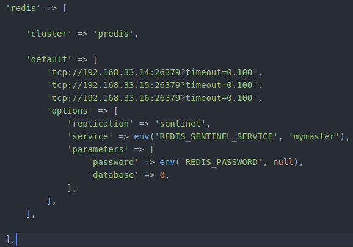

# Laravel Blog with Redis ft. NDB
>Forked from https://github.com/milon/laravel-blog

### Configuration
- Edit .env
    - `CACHE_DRIVER=redis`
    - `SESSION_DRIVER=redis`
- `composer require predis/predis`
- config/database.php
    - 
    - Set your mysql engine => NDB
